# 一、项目简介

## 1.1、项目背景

每个业务系统都有日志，当系统出现问题的时候，需要通过日志来定位和解决问题。当系统机器比较小的时候，登陆到服务器上查看即可满足，但是如今的分布式系统架构下，一个完整的系统往往通过模块拆分部署到很多台机器上，一台一台登陆查看问题不现实，因此需要一个日志收集系统来提供唯一入口对所有日志信息进行完整的收集。

**项目难题**：

+ 实时日志量非常大，每天处理几十万条的日志数据。
+ 日志收集需要实时精准，延迟控制在分钟级别。
+ 能够支持水平拓展。

## 1.2、业界解决方案

**ELK日志监控系统**：“ELK”是三个开源项目的首字母缩写，这三个项目分别是：Elasticsearch、Logstash 和 Kibana。Elasticsearch 是一个搜索和分析引擎。Logstash 是服务器端数据处理管道，能够同时从多个来源采集数据，转换数据，然后将数据发送到诸如 Elasticsearch 等“存储库”中。Kibana 则可以让用户在 Elasticsearch 中使用图形和图表对数据进行可视化。

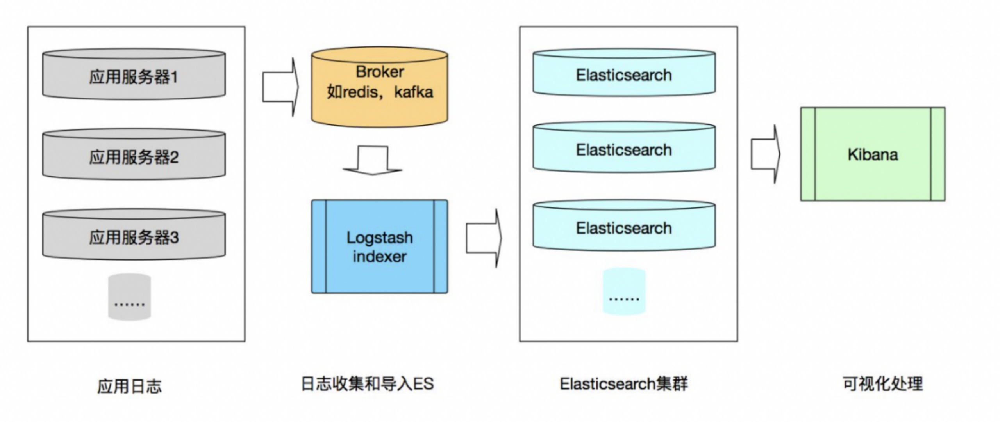


**缺点**：

1. 运维成本高、没增加一个日志修改项，都需要手动修改配置。
2. 监控缺失，无法准确获取Logstash 的状态。
3. 项目耦合性比较高，无法做到定制化开发和维护。

基于上述缺点，于是希望能够开发一套能够自动监听日志配置变更、对于日志收集节点的状态能够准确获取、并且能够支持丰富水平拓展的日志收集系统。

## 1.3、架构设计

**初想法**：将机器上的日志实时收集，统一的存储到中心系统，对日志建立索引，通过搜索即可快速找到对应的日志记录，最后提供一个界面友好的的web页面来实现日志的检索与展示。


其中`Log Agent`和`log tranfer`是我们要开发的，类似生产者消费者。其中`Log Agent`将来部署到需要收集日志的服务器上，将日志从业务线上拉取下来（业务线可能采用各种各样的语言开发，日志会写入文件中，也就是从文件中拉取）然后发到 Kafka 中，`log tranfer`负责从 Kafka 中取日志，Kafka 还可以做成集群的方式，可以用 Zookeerper 来维护集群的自动注册、自动发现等功能。取出来的日志由三种流向：

1. 发送到 ES 中，然后由 Kibana 做数据的展示便于客户端操作
2. 写入 InfluxDB 中，然后通过 Grafana 进行数据的展示

图中`etcd`用来做配置管理，实时监控`Log Agent`和`tranfer`，告知如果配置变化需要实时热加载。etcd 的配置管理同样提供一个 web 界面供客户端访问。最终的项目成果也就是给客户端提供了一个统一的web界面，能够便捷的进行配置管理、查看搜索所有的日志信息。

## 1.4、组件介绍


+ `LogAgent`：日志收集客户端，用来收集服务器上的日志。
+ `Kafka`：高吞吐量的分布式队列（由著名职业社交公司LinkedIn开发，apache顶级开源项目）。
+ `LogTransfer`：日志转发客户端，用于从 Kafka 中取出数据转发给其他平台，例如 ES、InfluxDB 等等。
+ `ElasticSearch`：开源的搜索引擎，提供基于HTTP RESTful的web接口。
+ `Kibaba`：开源的ES数据分析和可视化工具。
+ `InfluxDB`：开源分布式时序、事件和指标数据库。
+ `Grafana`：展示数据的工具，监控数据可视化，包含丰富的图表与插件，最新版本支持告警功能。后端也采用 Golang 开发，支持 SQL 查询方式。
+ `etcd`：开源的、高可用的分布式 key-value 存储系统，可以用于配置共享和服务的注册和发现。

## 1.5、项目代码层级设计

```shell
.
├── etcd-manage		# etcd可视化web模块
│   ├── bin					- 初始化配置层
│   ├── program			- 服务层
│   ├── static			- 静态目录层
│   └── tpls				- 模版文件层
├── influxDB			# 系统性能指标收集模块
│   ├── dao					- 数据访问层
│   └── sysInfo			- 系统信息收集层
├── log_agent			# 日志收集模块
│   ├── conf				- 配置层
│   ├── etcd				- etcd操作层
│   ├── kafka				- kafka操作层
│   └── tail				- 日志收集任务层
├── log_transfer	# 日志消费模块
│   ├── conf				- 配置层
│   ├── es					- elasticsearch操作层
│   ├── kafka				- kakfa操作层
└── logs					# 模拟待收集日志文件
```

## 1.6、运行方式

**前置环境**：

+ go1.17.1
+ apache-zookeeper-3.7.0
+ kafka_2.13-3.0.0
+ etcd-v3.5.1
+ elasticsearch-7.15.2
+ influxdb-1.8.10-1
+ grafana-8.2.4
+ kibana-7.15.2-darwin-x86_64

**运行方式**：

```shell
# 1.克隆项目
git clone https://gitee.com/zhong_siru/log-collection-system.git

# 2.下载依赖
go mod tidy

# 3.启动etcd可视化界面etcd-manage
go run etcd-manage/main.go

# 4.启动日志收集模块log agent
go run log_agent/main.go

# 5.启动日志消费模块log transfer
go run log_transfer/main.go

# 6.启动系统性能指标采集模块
go run influxDB/main.go
```

然后访问`127.0.0.1:3000`可以进入etcd可视化web界面，添加日志配置项，收集指定位置文件

访问`127.0.0.1:5601`可以进入kibana界面

访问`http://localhost:3000`可以进入grafana界面


# 二、开发环境与技术栈

+ **系统环境**：MacBook Air （M1，2020）
+ **开发工具**：Goland（代码编写IDE）
+ **开发语言**：Golang
+ **数据库**：InfluxDB
+ **搜索引擎技术**：ElasticSearch
+ **配置中心**：etcd +etcd-manase（可视化web界面）
+ **消息中间件**：Kafka
+ **可视化平台**：Grafana+ Kibaba
+ **协同开发**：项目的开发采用Git作为版本控制工具，所有代码实时同步到远程代码仓库


# 三、项目成果展示

## 3.1、系统性能指标实时采集展示

当启动系统性能指标采集模块时，服务会实时采集当前主机的cpu占用、磁盘、内存、网络速率各种指标指标写入InfluxDB时序数据库中

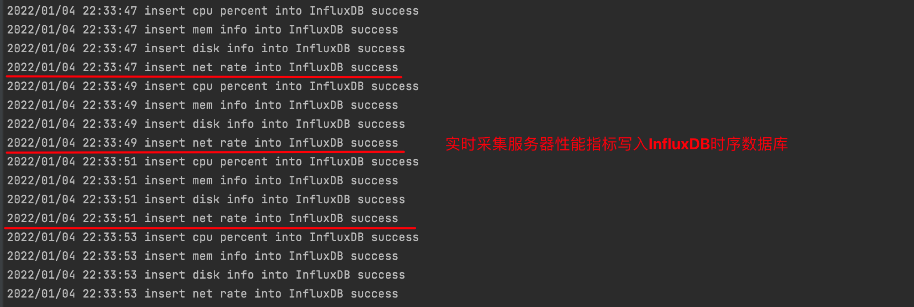

然后我们可以通过可视化数据展示平台Grafana来通过各种图形表格来实时展示这些指标

**网络速率**：

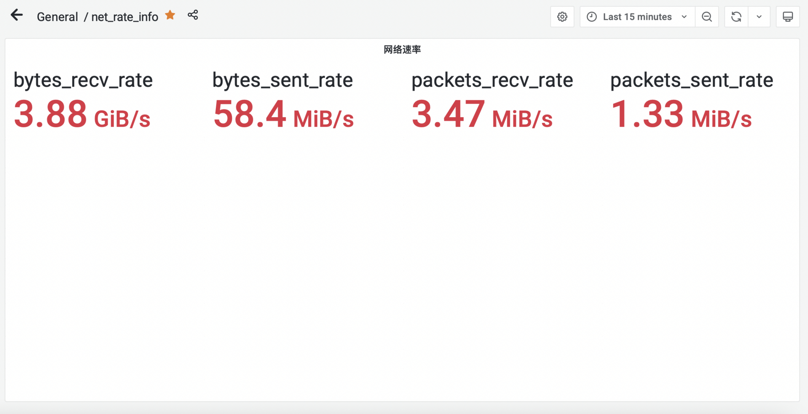

**cpu占用率**

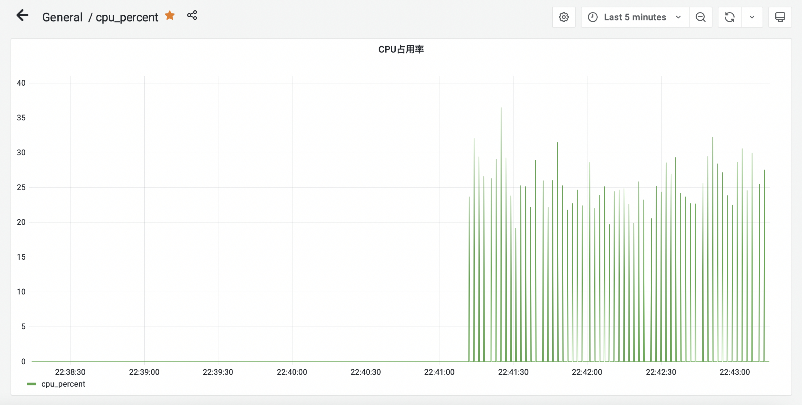

**内存信息**

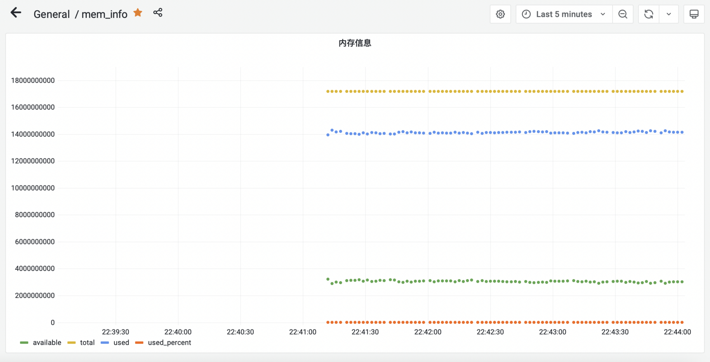

**磁盘空间**

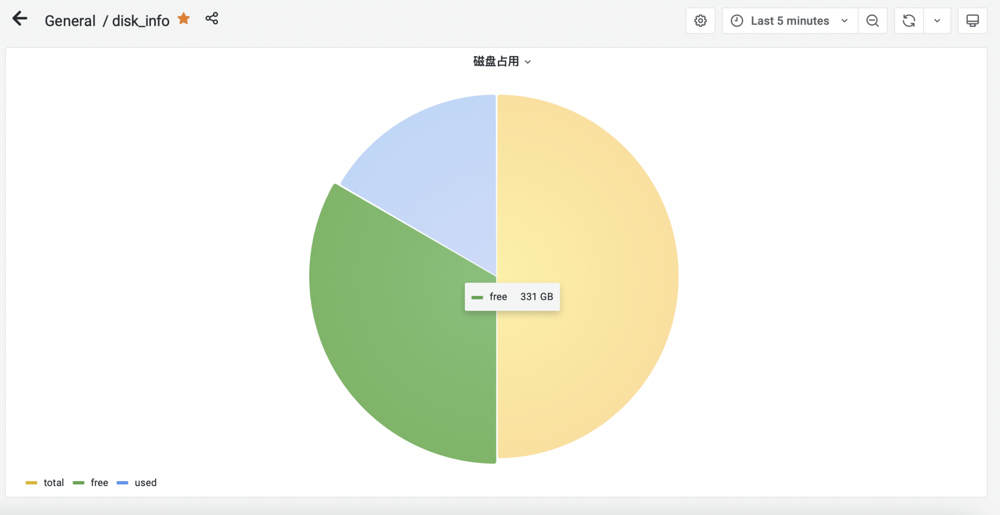

## 3.2、etcd配置中心可视化展示界面

下图是etcd配置中心可视化操作页面，我们可以可视化的以键值对的形式配置日志收集项的配置，

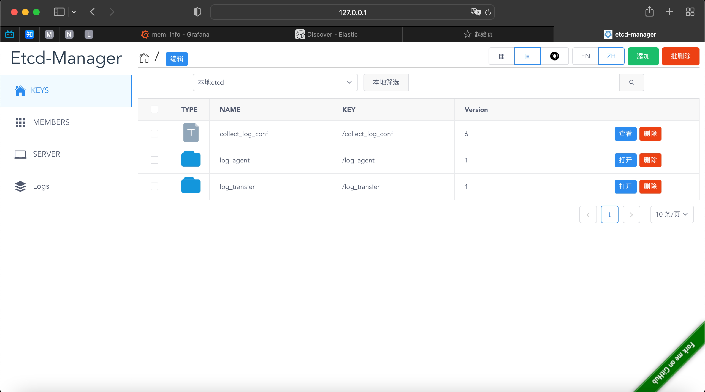

这里的日志配置key为 /collect_log_conf，采用key-value的形式，value采用json的格式，包含收集日志的路径path和需要存放进kafka中的消息主题topic。如下图所示：

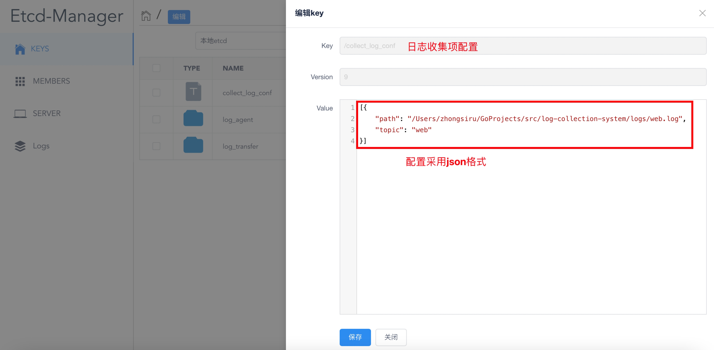

这里的示例追踪本机路径下/Users/zhongsiru/GoProjects/src/log-collection-system/logs/web.log的日志文件，存入kafka中的主题为web

## 3.3、日志实时收集与展示检索界面

首先启动log agent日志收集模块，根据终端打印内容，首先可以看到首先加载初始化配置，然后分别初始化kafka和etcd，然后开启了一个日志收集任务，并实时追踪etcd中日志配置项中的日志文件，也就是上图中配置的 /Users/zhongsiru/GoProjects/src/log-collection-system/logs/web.log

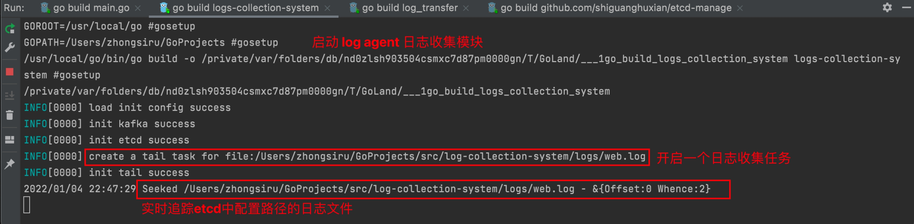

然后启动log transfer日志消费模块，根据终端打印内容可以同样是首先加载初始化配置，然后分别初始化kafka和etcd

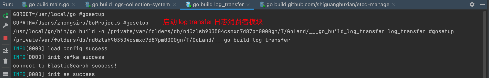

当log agent和log transfer都启动成功后，我们来到监听的web.log日志文件模拟写入1条日志：

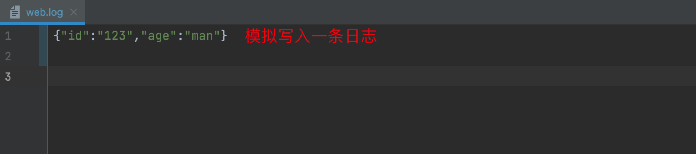

然后我们可以在log agent输出上看到它将这条新增的日志数据写入了kafka

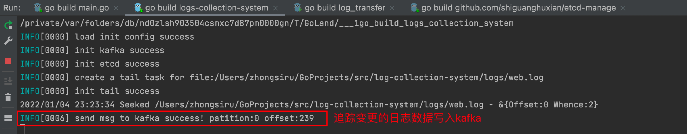

同时查看log transfer输出，可以看到它收到了这条日志数据，并成功写入了elasticsearch中的区域为我们上述配置的web

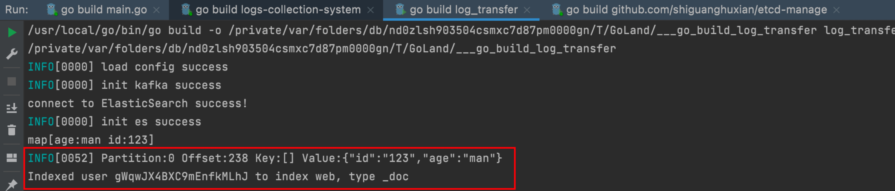

然后我们可以来到 kibana可视化界面，能够在web类型中看到新增的日志，并且可以进行索引等各种操作

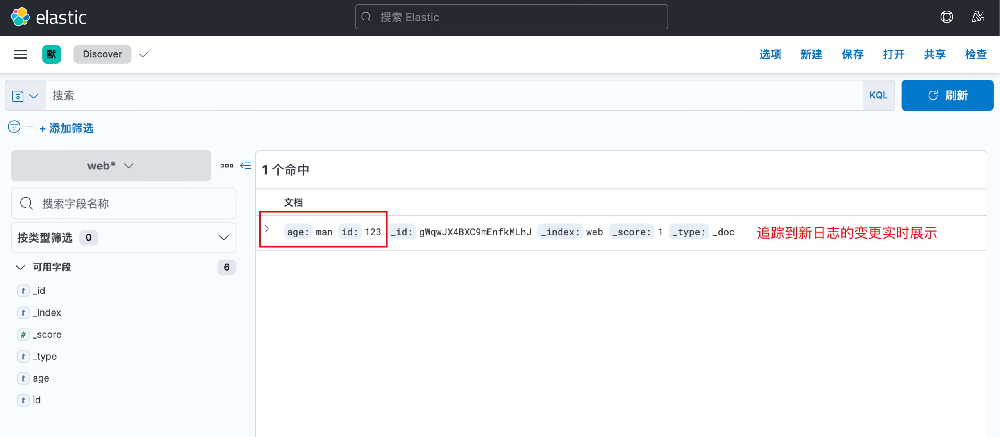

如果我们再新增几条数据，kibana界面会实时更新展示并提供快速的索引功能

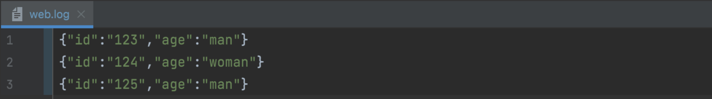

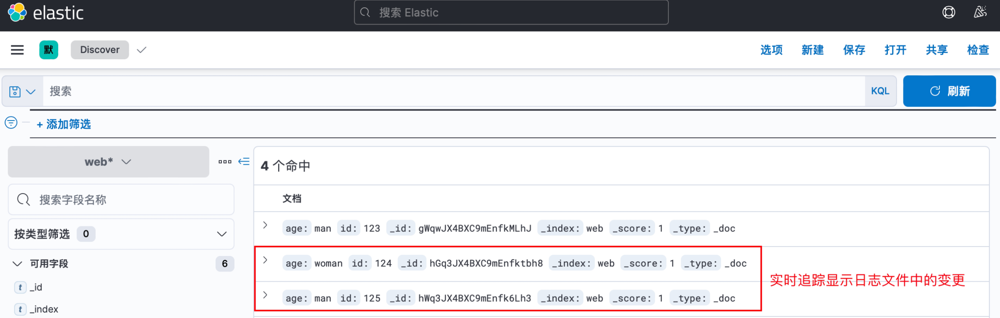

## 3.4、日志收集项配置热推送

如果我们修改etcd中的日志收集项，比如这里更改日志文件的路径path和要存入的区域topic都为net

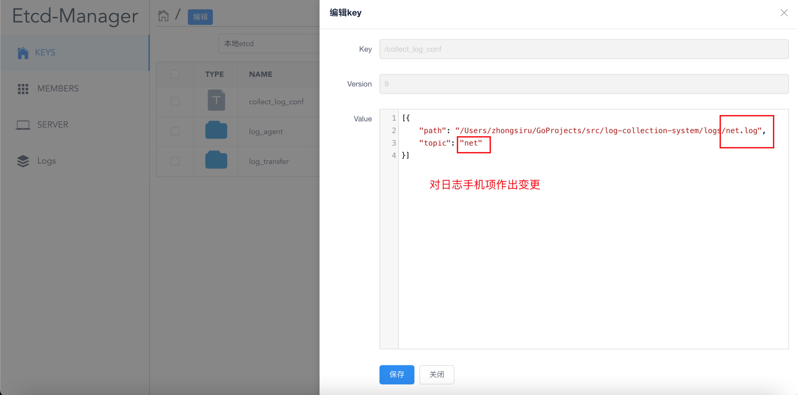

点击保存的一瞬间，log agent日志收集模块会立马监听到日志收集项的变化，立即从etcd获取新的日志收集项配置，然后停止先前的日志收集任务，立马启动一个新的日志收集任务，监听新的日志文件

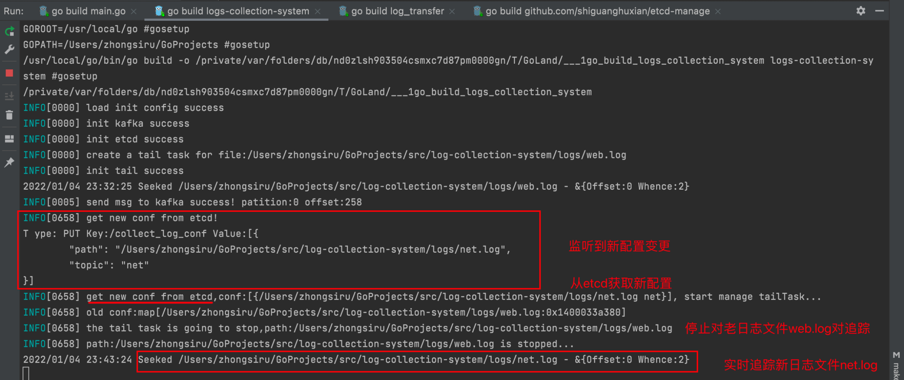

此时我们模拟在新的日志文件net.log作出日志变更，这里插入两条相同的数据


然后回到 kibana，我们选择net模块，就可以立马看到新增的net.log中的日志数据

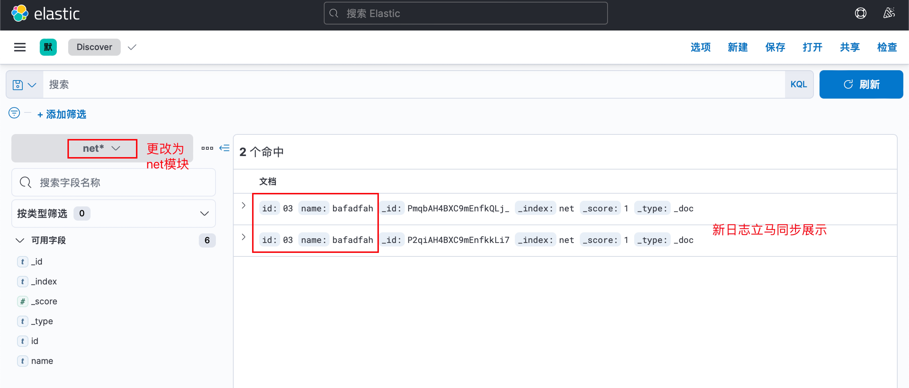

以上过程就实现了配置变更的热部署与日志的重新收集加载


# 四、后续优化

## 4.1、容器化运维

项目环境依赖过多，可以通过编写DockerFile统一打成一个Docker镜像一件拉取运行，避免环境配置的繁杂。

此外，如果后续项目需要持续庞大，可以使用开源CI/CD平台例如Jenkins进行持续集成持续部署。


## 4.2、Kafka+Zookeeper集群化

> Zookeeper 是一个基于**观察者模式**设计的**分布式服务管理框架**，它负责存储和管理大家都关心的数据，然后接受观察者的注册，一旦这些数据的状态发生变化，Zookeeper 就将负责通知已经在 Zookeeper 上注册的那些观察者做出相应的反应。

当前系统适用于单机情况，但对于现实的生产环境，一定需要配置Kafka集群，然后需要用Zookeeper对集群进行管理，提供诸如以下的功能：

+ **统一命名服务**（在分布式环境下，经常需要对应用/服务进行统一命名，例如域名服务，便于识别）

  

+ **统一集群管理**（例如节点动态上下线）

  

+ **软负载均衡**

  

## 4.3、引入协程池

当前适用于单机情况，基本通过单个协程对来的请求进行处理，在高并发情况下会出现单点压力，因此可以引入协程池动态创建管理协程，避免协程创建和销毁所占用的资源。


